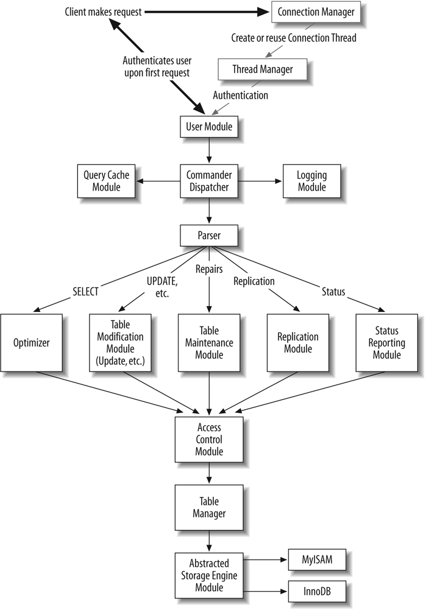

## MySQL 的源码模块

下图是 mysql 的核心模块，以及它们之间的交互逻辑

主要模块如下

- 服务初始化 [Server Initialization Module]
服务器在命令行启动，初始化模块开始工作。它解析配置文件和命令行参数，申请全部的内存缓存，初始化全局变量和结构体，加载访问控制表，运行一些初始化任务。一旦初始化工作完成，初始化模块把控制权交给连接管理模块，监听并等待新的连接到来。

- 连接管理 [Connection Manager]
- 线程管理 [Thread Manager]
- 连接线程 [Connection Thread]
- 用户认证 [User Authentication Module]
- 访问控制 [Access Control Module]
- sql解析模块 [Parser]
- 命令分发 [Command Dispatcher]
- 查询缓存 [Query Cache Module]
- 优化器 [Optimizer]
- 表管理 [Table Manager]
- 表修改 [Table Modification Modules]
- 表维护 [Table Maintenance Module]
- 状态上报 [Status Reporting Module]
- 抽象存储引擎接口 [Abstracted Storage Engine Interface (Table Handler)]
- 存储引擎实现 [Storage Engine Implementations]
- 日志 [Logging Module]
- 主复制 [Replication Master Module]
- 从复制 [Replication Slave Module]
- 客户端/服务端 协议 api [Client/Server Protocol API]
- 底层网络 io api [Low-Level Network I/O API]
- 核心 api [Core API]

